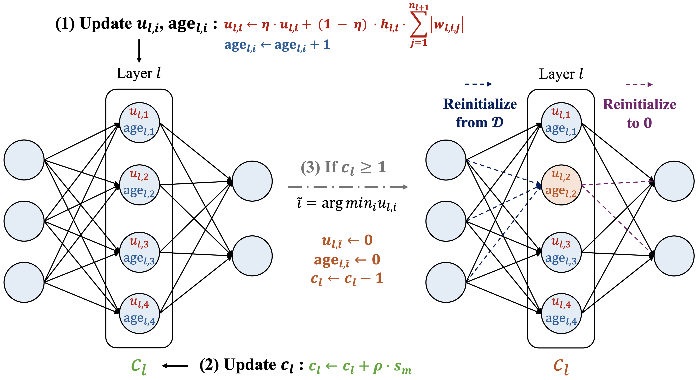
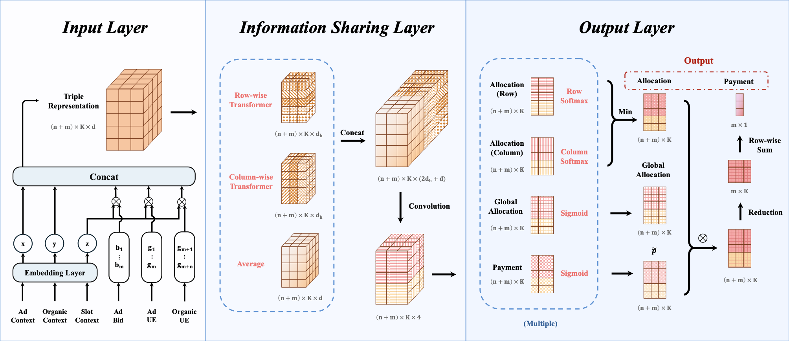
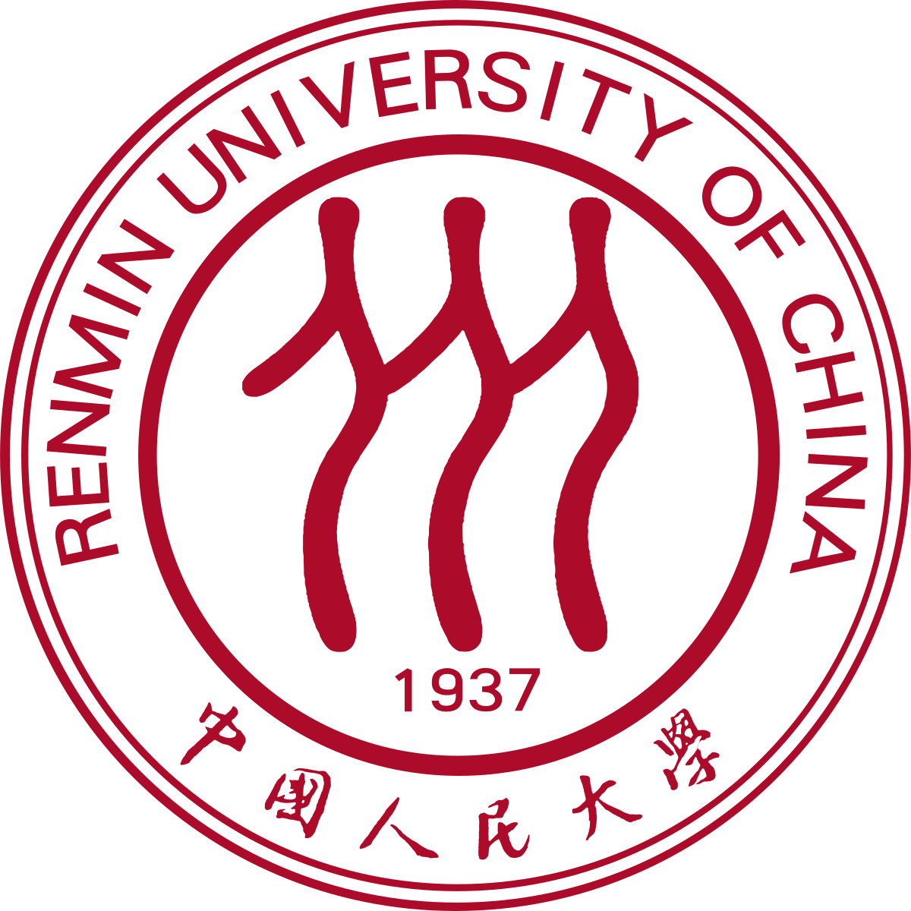
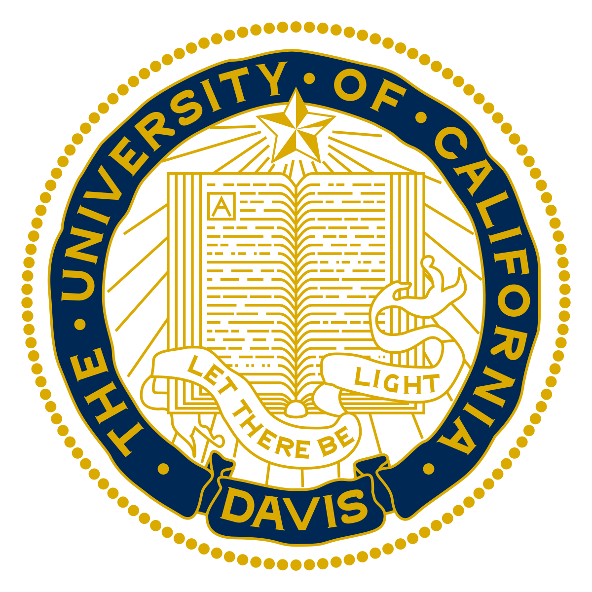
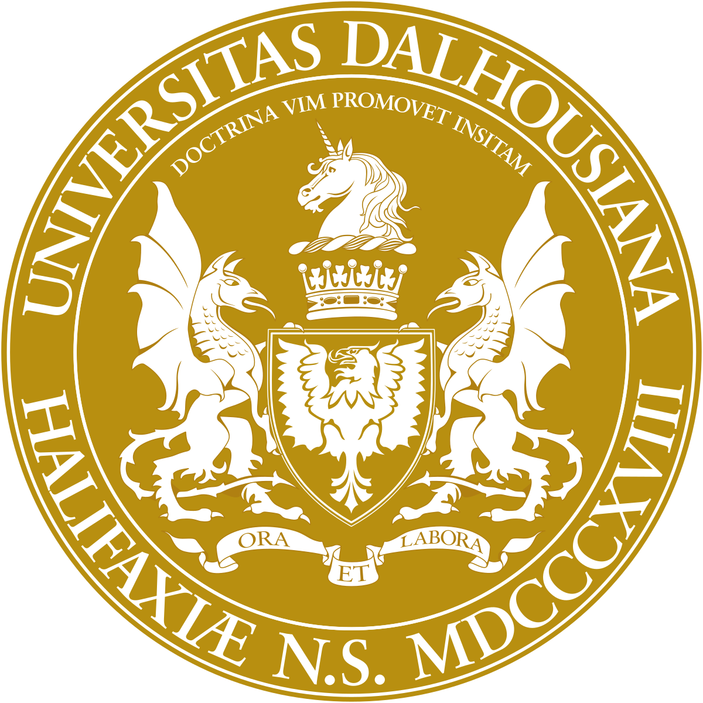
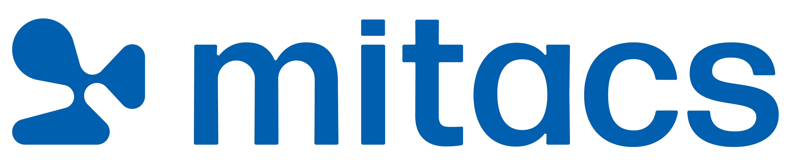








Hi, I am Zhiyuan Su. I am currently a **senior** undergraduate at [Gaoling School of Artificial Intelligence](http://ai.ruc.edu.cn/), [Renmin University of China](https://www.ruc.edu.cn/). I was an exchange student at [University of California, Davis](https://www.ucdavis.edu/) (2025.01 -- 2025.03). Now I am also a visiting research student at [Dalhousie University](https://www.dal.ca/) (2025.07 -- 2025.10), co-sponsored by [Mitacs, Canada](https://www.mitacs.ca/) and [China Scholarship Council](https://www.csc.edu.cn/).

My research interests focus on **deep reinforcement learning, online learning, continual learning, recommender system, and computational advertising**. Recently, I am focusing on:  
(1) sequential bidding ranking algorithms;  
(2) machine unlearning in generative recommendation.  
My research aims to build **intelligent systems that are elegant in theory and effective in practice**, and provide credible solutions to the urgent needs of contemporary society.

# 🔥 News
- *2025.07.08*: &nbsp;🎉 Selected to receive a SIGKDD-supported KDD 2025 Student Travel Award!
- *2025.06.30*: &nbsp;🎉 Received the presidential scholarship of **40,000 CNY** for being an outstanding exchange student at UC Davis.
- *2025.06.06*: &nbsp;🎉 Received a pre-departure scholarship of **3,600 CAD** from China Scholarship Council!
- *2025.05.15*: &nbsp;🎉 A paper about clustering of neural bandits was accepted by **KDD 2025 Research Track**. Congratulations to myself on my **first first-author paper**!
- *2025.03.25*: &nbsp;🎉 Completed Global Study Program at UC Davis and achieve **Academic Perfection**.
- *2025.02.03*: &nbsp;🎉 A paper about intergrating ad auctions and recommendations was accepted by **WWW 2025**. Congratulations to myself!
- *2024.12.10*: &nbsp;🎉 Admitted to the Mitacs Globalink Research Internship **full-scholarship** summer research program.

# 📝 Publications

KDD 2025

  
[Revisiting Clustering of Neural Bandits: Selective Reinitialization for Mitigating Loss of Plasticity](https://arxiv.org/pdf/2506.12389)

**Zhiyuan Su**, Sunhao Dai, Xiao Zhang

- *Accepted at ACM SIGKDD Conference on Knowledge Discovery and Data Mining (KDD) 2025* Oral
- [**Watch our promotional video on YouTube!**](https://www.youtube.com/watch?v=lATSWn7t_Xc)

WWW 2025

[A Context-Aware Framework for Integrating Ad Auctions and Recommendations](https://dl.acm.org/doi/pdf/10.1145/3696410.3714779?casa_token=8lqAC8Liak8AAAAA:lbsi8gr5tQAQds4gSyTdM3a7Rl43lK1yXwjDzjOtcXOxydg_JQJfvJxQtUKGAPxbZNspu3OlGT5ZcQ)

Yuchao Ma, Weian Li, Yuejia Dou, **Zhiyuan Su**, Changyuan Yu, Qi Qi

- *Accepted at ACM The Web Conference (WWW) 2025* Poster

# 🎖 Honors and Awards
- *2025.07*: &nbsp;💰 SIGKDD-supported KDD 2025 *Student Travel Award* – 1,000 USD
- *2025.06*: &nbsp;💰 *Presidential Scholarship* for Outstanding International Exchange – 40,000 CNY
- *2025.04*: &nbsp;💰 *Municipal Approval* for Student Innovation Project – 7,500 CNY
- *2025.01*: &nbsp;💰 Mitacs-CSC Co-sponsored Scholarship – 6,000 CAD
- *2024.12*: &nbsp;🏆 *National Second Prize*, 19th "Challenge Cup" National Undergraduate Curricular Academic Science and Technology Works
- *2024.10*: &nbsp;🏆 *Second Prize*, Beijing Mathematical Contest in Modeling
- *2024.10*: &nbsp;💰 *Second-class* Academic Scholarship – 3,000 CNY
- *2024.04*: &nbsp;💰 *Municipal Approval* for Student Innovation Project – 7,500 CNY
- *2024.04*: &nbsp;🎖 Outstanding Communist Youth League Member

# 📖 Educations
- *2025.01 – 2025.03*: &nbsp;🇺🇸 **Global Study Program, University of California, Davis**
  
  *- Major: Mathematics & Statistics, Graduated with Academic Perfection*

- *2022.09 – Present*: &nbsp;🇨🇳 **Gaoling School of Artificial Intelligence, Renmin University of China**
  
  *- Bachelor of Engineering in Artificial Intelligence, Supervisors: [Dr. Qi Qi](https://gsai.ruc.edu.cn/qiqi), [Dr. Xiao Zhang](https://pinkfloyd1989.github.io/Xiao_Zhang/)*

# 💻 Work Experiences
- *2025.07 – 2025.10*: &nbsp;🇨🇦 *Mitacs Globalink Research Intern & Visiting Research Student*, [Faculty of Computer Science](https://www.dal.ca/faculty/computerscience.html), Dalhousie University

  *- Lab: [Dalhousie Applied Machine Learning Research Lab](https://web.cs.dal.ca/~gaw/), Collaborator: [Dr. Ga Wu](https://wuga214.github.io/)*
  
  *- Project: AI safety for recommender systems in social media services*
  
- *2024.11 – Present*: &nbsp;🇨🇳 *Research Intern*, Beijing Key Laboratory of Research on Large Models and Intelligent Governance
- *2024.05 – 2024.09*: &nbsp;🇨🇳 *Research Intern*, Engineering Research Center of Next-Generation Intelligent Search and Recommendation, MOE

# 💼 Services
- Artifact badging reviewer, KDD 2025

# 🪽 Beyond Academics

I love **music, literature, travel and badminton**. I am a **campus singer** at Renmin University of China and have been invited to participate in various concerts and music festivals at RUC. I am also a **musician at NetEase Cloud Music**, and my stage name is [艾诺 Ayinor](http://music.163.com/#/artist?id=36180214). Recently, I am also working on my own new song, so stay tuned!

# 🌍 Visitor Map

  
  
  
  

<footer class="site-footer">
  
&copy; 2025 Zhiyuan Su. All rights reserved.

  

    Template adapted from
    <a href="https://github.com/RayeRen/acad-homepage.github.io"
       target="_blank" rel="noopener">Yi Ren</a>.
  

</footer>
