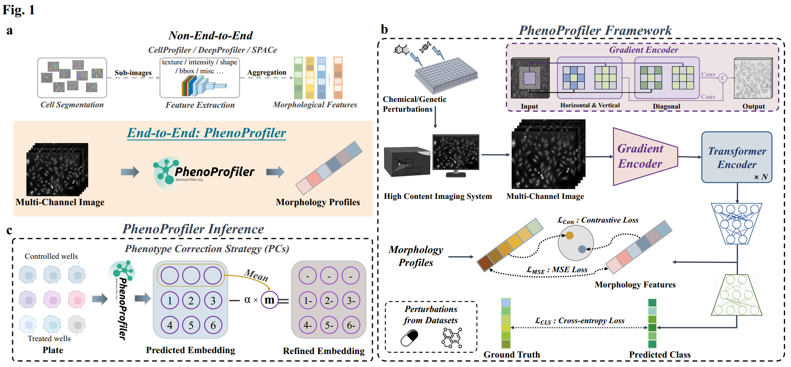
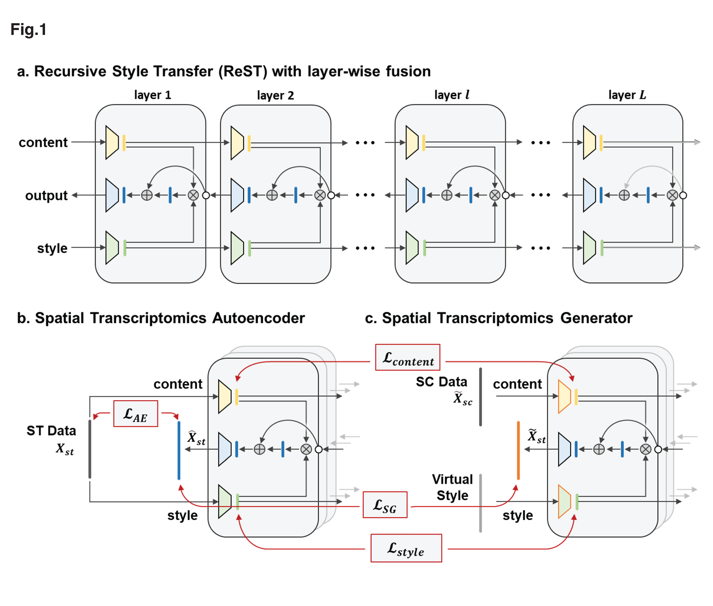








Hi, I'm Bo Li, a Ph.D. student at the [University of Macau](https://www.um.edu.mo/), supervised by [Prof. Bob Zhang](https://www.fst.um.edu.mo/personal/bobzhang/). My research is co-supported by [Prof. Qianqian Song](https://hobi.med.ufl.edu/profile/song-qianqian/) from the [University of Florida](https://www.ufl.edu/), where I collaborate on interdisciplinary projects at the intersection of **AI Virtual Cell**.

My research interests focus on **AI Virtual Cell & Phenotypic Drug Discovery & Cell Painting**. Recently, I am focusing on:  
(1) modeling virtual cells with generative models; 
(2) evaluating large foundation models in virtual cell tasks. 

# 📝 Selected Publications

ArXiv 2025

[PhenoProfiler : Advancing Morphology Representations for Image-based Drug Discovery](https://arxiv.org/abs/2502.19568)[Code](https://github.com/QSong-github/PhenoProfiler)

**Bo Li**, Bob Zhang, Chengyang Zhang, Minghao Zhou, Weiliang Huang, Shihang Wang, Qing Wang, Mengran Li, Yong Zhang, Qianqian Song

ArXiv 2025

[SpaIM: Single-cell Spatial Transcriptomics Imputation via Style Transfer](https://pmc.ncbi.nlm.nih.gov/articles/PMC11838188/)[Code](https://github.com/QSong-github/SpaIM)

**Bo Li**, Ziyang Tang, Aishwarya Budhkar, Xiang Liu, Tonglin Zhang, Baijian Yang, Jing Su, Qianqian Song

# 🎖 Honors and Awards
- *2025.07*: &nbsp;💰 SIGKDD-supported KDD 2025 *Student Travel Award* – 1,000 USD
- *2025.06*: &nbsp;💰 *Presidential Scholarship* for Outstanding International Exchange – 40,000 CNY
- *2025.04*: &nbsp;💰 *Municipal Approval* for Student Innovation Project – 7,500 CNY
- *2025.01*: &nbsp;💰 Mitacs-CSC Co-sponsored Scholarship – 6,000 CAD
- *2024.12*: &nbsp;🏆 *National Second Prize*, 19th "Challenge Cup" National Undergraduate Curricular Academic Science and Technology Works
- *2024.10*: &nbsp;🏆 *Second Prize*, Beijing Mathematical Contest in Modeling
- *2024.10*: &nbsp;💰 *Second-class* Academic Scholarship – 3,000 CNY
- *2024.04*: &nbsp;💰 *Municipal Approval* for Student Innovation Project – 7,500 CNY
- *2024.04*: &nbsp;🎖 Outstanding Communist Youth League Member

# 📖 Educations
- *2025.01 – 2025.03*: &nbsp;🇺🇸 **Global Study Program, University of California, Davis**
  
  *- Major: Mathematics & Statistics, Graduated with Academic Perfection*

- *2022.09 – Present*: &nbsp;🇨🇳 **Gaoling School of Artificial Intelligence, Renmin University of China**
  
  *- Bachelor of Engineering in Artificial Intelligence, Supervisors: [Dr. Qi Qi](https://gsai.ruc.edu.cn/qiqi), [Dr. Xiao Zhang](https://pinkfloyd1989.github.io/Xiao_Zhang/)*

# 💻 Work Experiences
- *2025.07 – 2025.10*: &nbsp;🇨🇦 *Mitacs Globalink Research Intern & Visiting Research Student*, [Faculty of Computer Science](https://www.dal.ca/faculty/computerscience.html), Dalhousie University

  *- Lab: [Dalhousie Applied Machine Learning Research Lab](https://web.cs.dal.ca/~gaw/), Collaborator: [Dr. Ga Wu](https://wuga214.github.io/)*
  
  *- Project: AI safety for recommender systems in social media services*
  
- *2024.11 – Present*: &nbsp;🇨🇳 *Research Intern*, Beijing Key Laboratory of Research on Large Models and Intelligent Governance
- *2024.05 – 2024.09*: &nbsp;🇨🇳 *Research Intern*, Engineering Research Center of Next-Generation Intelligent Search and Recommendation, MOE

# 💼 Services
- Artifact badging reviewer, KDD 2025

# 🪽 Beyond Academics

I love **music, literature, travel and badminton**. I am a **campus singer** at Renmin University of China and have been invited to participate in various concerts and music festivals at RUC. I am also a **musician at NetEase Cloud Music**, and my stage name is [艾诺 Ayinor](http://music.163.com/#/artist?id=36180214). Recently, I am also working on my own new song, so stay tuned!

# 🌍 Visitor Map

  
  
  
  

<footer class="site-footer">
  
&copy; 2025 Zhiyuan Su. All rights reserved.

  

    Template adapted from
    <a href="https://github.com/RayeRen/acad-homepage.github.io"
       target="_blank" rel="noopener">Yi Ren</a>.
  

</footer>
