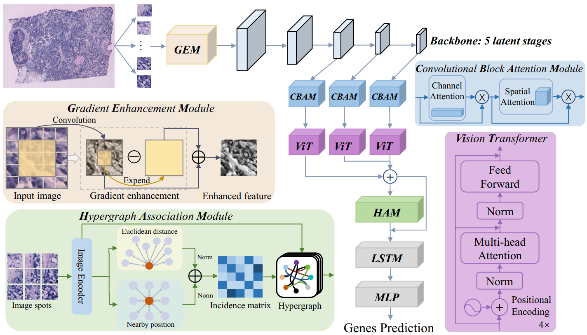
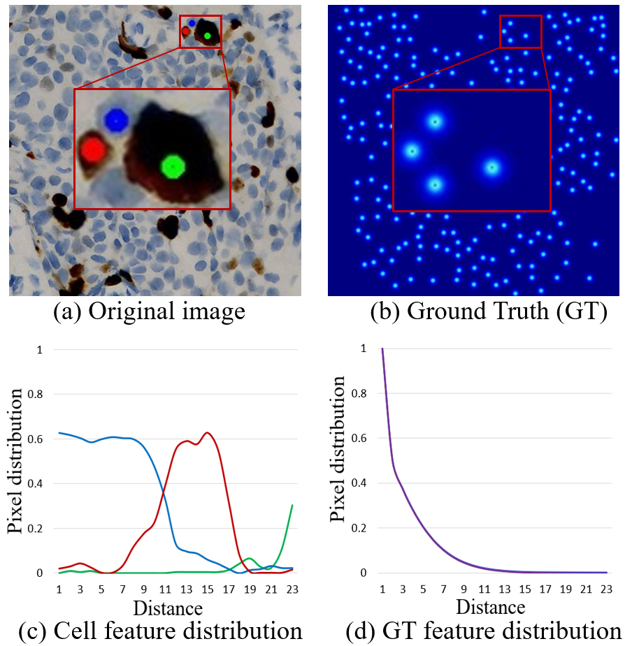
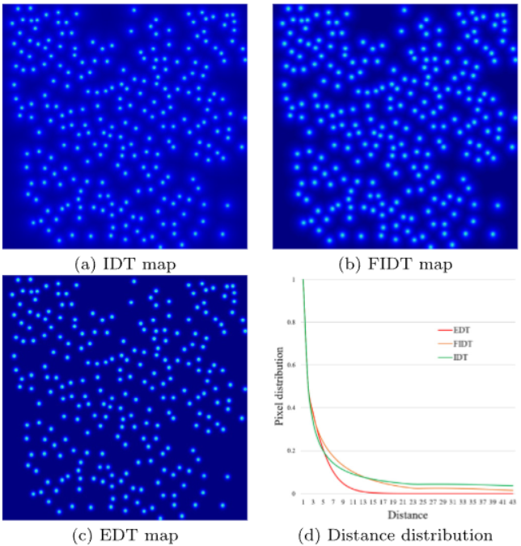








Hi, I'm Bo Li, a Ph.D. student at the [University of Macau](https://www.um.edu.mo/), supervised by [Prof. Bob Zhang](https://www.fst.um.edu.mo/personal/bobzhang/). My research is co-supported by [Prof. Qianqian Song](https://hobi.med.ufl.edu/profile/song-qianqian/) from the [University of Florida](https://www.ufl.edu/), where I collaborate on interdisciplinary projects at the intersection of **AI Virtual Cell**.

My research interests focus on **AI Virtual Cell & Phenotypic Drug Discovery & Cell Painting**. Recently, I am focusing on:  

(1) Modeling virtual cells with generative models; 

(2) Evaluating large foundation models in virtual cell tasks. 

# 🔥 News
- *2025*: &nbsp;🎉🎉 happy everyday

# 📝 Selected Publications

ArXiv 2025

[PhenoProfiler : Advancing Morphology Representations for Image-based Drug Discovery](https://arxiv.org/abs/2502.19568)

[Code](https://github.com/QSong-github/PhenoProfiler), [WebServer](https://phenoprofiler.org/)

**Bo Li**, Bob Zhang, ..., Qianqian Song

Under review in Nature Communications (Major Revision)

**Abstract**: Achieving end-to-end cell image encoding for the first time in Image-based Phenotypic Drug Discovery tasks, with performance comparable to non-end-to-end encoding while reducing inference time by approximately 40 times.

ArXiv 2025

[SpaIM: Single-cell Spatial Transcriptomics Imputation via Style Transfer](https://pmc.ncbi.nlm.nih.gov/articles/PMC11838188/) 

[Code](https://github.com/QSong-github/SpaIM)

**Bo Li**, Ziyang Tang, ..., Qianqian Song

Under review in Nature Communications (Minor Revision)

**Abstract**: Predicting unmeasured gene expression in spatial transcriptomics (ST) using single-cell RNA sequencing (scRNA-seq) and achieving state-of-the-art (SOTA) performance in cross-modal imputation based on style transfer concepts.

Briefings in Bioinformatics 2024

[Gene Expression Prediction from Histology Images via Hypergraph Neural Networks](https://academic.oup.com/bib/article/25/6/bbae500/7821151) 

[Code](https://github.com/QSong-github/HGGEP)

**Bo Li**, Yong Zhang, ..., Qianqian Song

Briefings in Bioinformatics 2024

**Abstract**: Constructing a hypergraph via Euclidean distance and adjacent position weighting to exploit local correlations in cell images, enabling gene expression prediction for cells in Whole Slide Image (WSI) pathology images.

Pattern Recognition 2024

[Multi-scale hypergraph-based feature alignment network for cell localization](https://www.sciencedirect.com/science/article/pii/S0031320324000116) 

[Code](https://github.com/Boom5426/MHFAN)

**Bo Li**, Yong Zhang, ..., Baocai Yin

Pattern Recognition 2024

**Abstract**: Rethinking the cell localization task from the perspective of feature alignment for the first time and proposing a multi-scale hypergraph module that significantly improves accuracy by adaptively aggregating multi-level features.

EAAI 2024

[Exponential distance transform maps for cell localization](https://www.sciencedirect.com/science/article/pii/S0952197624001064?via%3Dihub) 

[Code](https://github.com/Boom5426/MHFAN)

**Bo Li**, Jie Chen, ..., and Hong Bu

Engineering Applications of Artificial Intelligence 2024

**Abstract**: To address the challenge of existing density maps losing cell location information in dense regions, a new exponential distance transform map is proposed to provide accurate cell location information with reasonable gradients.

# 📖 Educations
- *2024.08 – Present*: **University of Macau**
  
  *- Major: Computer Science, Full Scholarship, Supervisors: [Prof. Bob Zhang](https://www.fst.um.edu.mo/personal/bobzhang/), [Prof. Qianqian Song](https://hobi.med.ufl.edu/profile/song-qianqian/)*

- *2021.09 - 2024.07*: **Beijing University of Technology**
  
  *- Master of Electronic Information, Supervisors: [Prof. Yong Zhang](https://sist.bjut.edu.cn/info/1403/2489.htm), [Prof. Baocai Yin](https://sist.bjut.edu.cn/info/1403/2487.htm)*

- *2017.09 - 2021.07*: **Beijing Information Science & Technology University**
  
  *- Bachelor of Robotics Engineering, Supervisors: [Prof. Hongbo Huang](https://jsjxy.bistu.edu.cn/docs/2025-02/8d1313acd5814afd9f5d15f4b7b9403a.pdf)*

# 🎖 Honors and Awards
- *2024.07*: Top 100 Graduates of BJUT (Top 100/6331)
- *2024.07*: Excellent Graduate of Beijing
- *2023.10*: Xiaomi Scholarship
- *2023.10 & 2022.10*:The First Prize Scholarship
- *2022.10*: National Scholarship
- *2021.07*: Excellent Graduate of Beijing
- *2020.12*: The Second Prize of National Mathematics Competition

# 💻 Work Experiences
- *2022.05 – 2023.06*: *Algorithm Intern: Biomedical Image Analysis*, West China Hospital.

# 💼 Services
Reviewer: **Science Advances**, Briefings in Bioinformatics, BMC Biology, Engineering Applications of Artificial Intelligence, IET Image Processing.

# 🌍 Visitor Map

  
  
  
  

<footer class="site-footer">
  
&copy; 2025 Bo Li. All rights reserved.

  

    Template adapted from
    <a href="https://github.com/RayeRen/acad-homepage.github.io"
       target="_blank" rel="noopener">Yi Ren</a>.
  

</footer>
