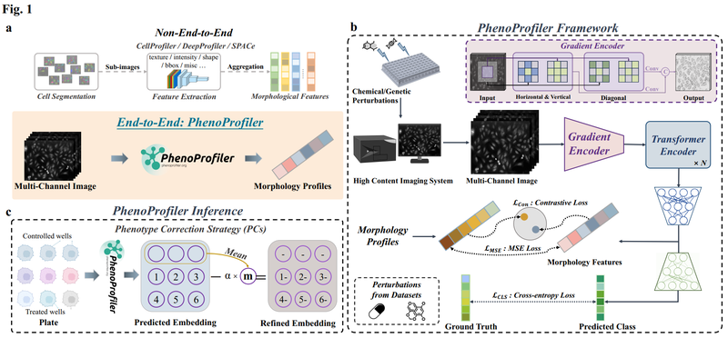
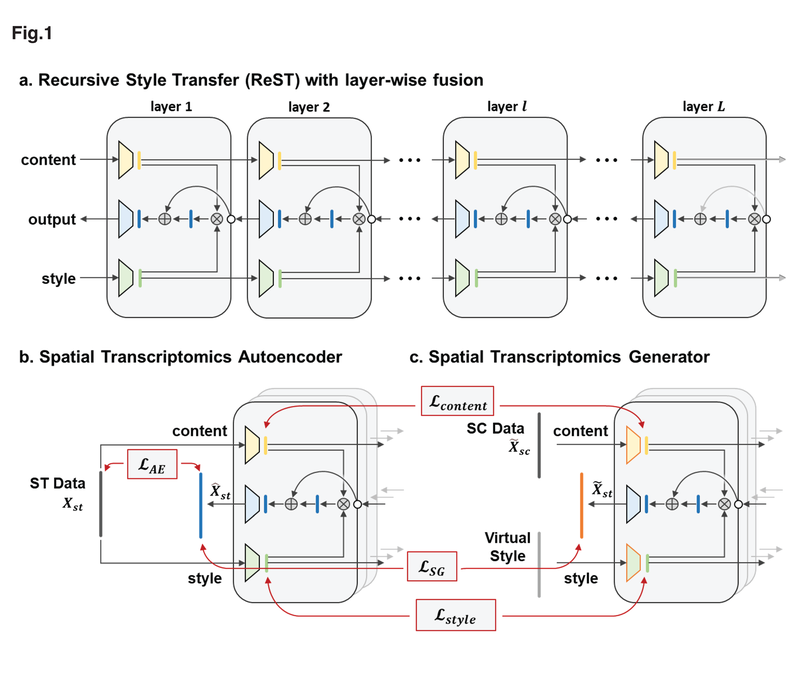
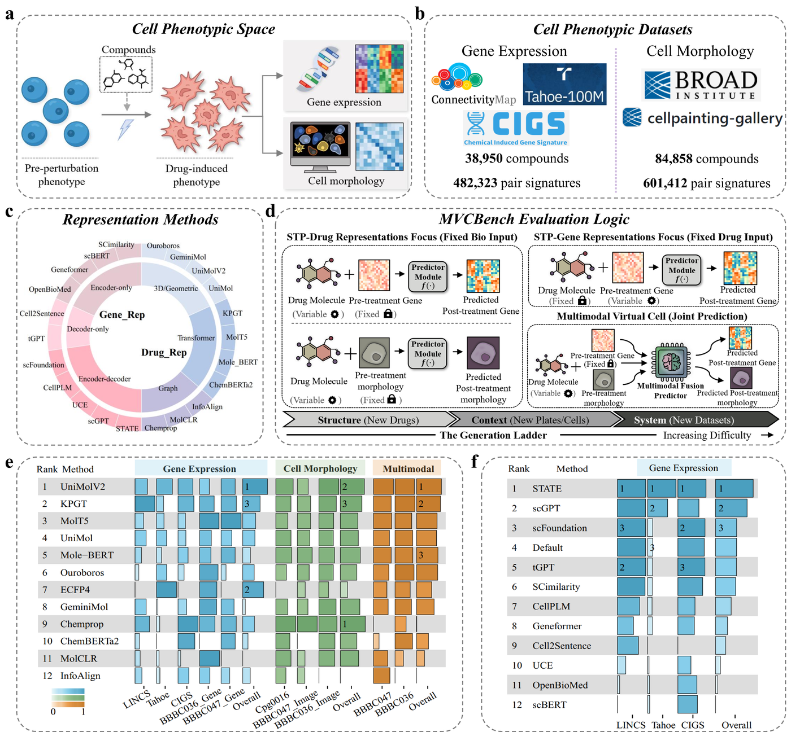
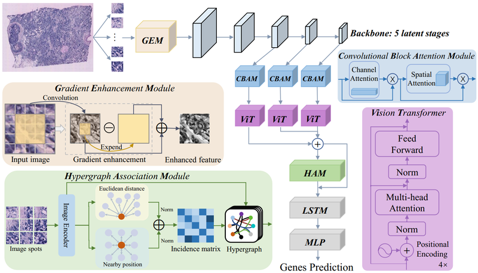
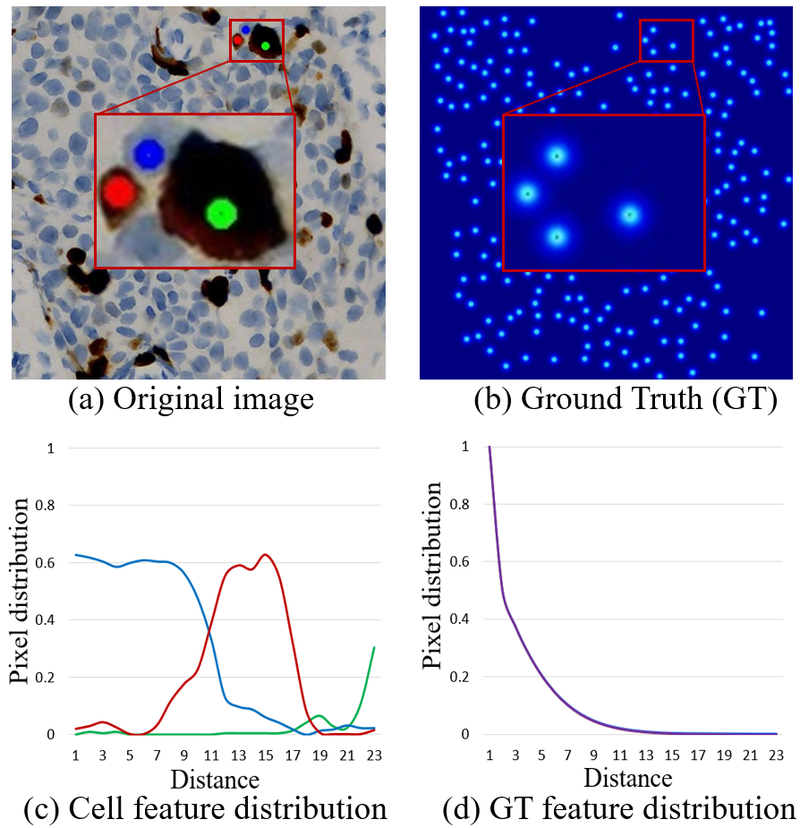

Hi, I'm **Bo Li (李波)**, a Ph.D. student in Computer Science at the [University of Macau](https://www.um.edu.mo/), advised by [Prof. Bob Zhang](https://www.fst.um.edu.mo/personal/bobzhang/) and co-advised by [Prof. Qianqian Song](https://hobi.med.ufl.edu/profile/song-qianqian/) (University of Florida). Since June 2026 I have been a visiting student at the [School of Computing, National University of Singapore](https://www.comp.nus.edu.sg/), hosted by Prof. Yang Zhang.

I build **multimodal virtual cell models**: systems that learn how cells respond to drugs across morphology, transcriptomics, and molecular structure, together with the **agent systems** that turn such models into automated scientific discovery. My work has moved along one continuous line, from perceiving cell phenotypes in images, to aligning them with molecular readouts, to benchmarking and orchestrating virtual cell models end to end.

  Phenotype perception→
  Cross-modal understanding→
  Multimodal virtual cell modeling→
  Multi-agent scientific systems

  8 first-author journal papers
  2 × Nature Communications
  <a href="https://scholar.google.com/citations?hl=en&user=y1myk_IAAAAJ">Citations: 520+</a>
  <a href="https://github.com/Boom5426">700+ GitHub stars</a>

  <a class="link-btn" href="mailto:yc47955@um.edu.mo">Email</a>
  <a class="link-btn ghost" href="https://scholar.google.com/citations?hl=en&user=y1myk_IAAAAJ">Google Scholar</a>
  <a class="link-btn ghost" href="https://github.com/Boom5426">GitHub</a>
  <a class="link-btn ghost" href="https://orcid.org/0000-0003-0608-1502">ORCID</a>
  <a class="link-btn ghost" href="{{ site.baseurl }}/files/CV_Bo_Li.pdf">CV (PDF)</a>

📫 **Contact**: yc47955@um.edu.mo &nbsp;·&nbsp; Boom985426@gmail.com &nbsp;·&nbsp; WeChat: Boom_5426

I am always open to collaborations on virtual cell modeling, phenotypic drug discovery, and agentic systems for science. Feel free to reach out.

# 🔥 News
- *2026.06*: &nbsp;🇸🇬 Started a one-year visit to the **School of Computing, National University of Singapore**, hosted by Prof. Yang Zhang.
- *2026.05*: &nbsp;📄 **CellScientist**, a dual-space hierarchical agent framework for closed-loop refinement of virtual cell models, is on [arXiv](https://arxiv.org/abs/2605.07335) (co-author).
- *2026.04*: &nbsp;🧬 **MVCBench**, our multimodal benchmark for drug-induced virtual cell phenotypes, is on [bioRxiv](https://www.biorxiv.org/content/10.64898/2026.04.22.720110v1).
- *2026*: &nbsp;🎉 *Permutation-Consistent Variational Encoding for Incomplete Multi-View Multi-Label Classification* accepted at **ICLR 2026** (co-author).
- *2025.12*: &nbsp;🎉 **PhenoProfiler** published in [***Nature Communications***](https://www.nature.com/articles/s41467-025-67479-w) (Nat Commun **17**, 793, 2026).
- *2025.08*: &nbsp;🎉 **SpaIM** published in [***Nature Communications***](https://www.nature.com/articles/s41467-025-63185-9).

# 📝 Selected Publications

Five representative works below. The complete list, including eight first-author journal papers, is on [Google Scholar](https://scholar.google.com/citations?hl=en&user=y1myk_IAAAAJ&view_op=list_works&sortby=pubdate).

Nature Communications 2026

[PhenoProfiler: Advancing Phenotypic Learning for Image-based Drug Discovery](https://www.nature.com/articles/s41467-025-67479-w)

**Bo Li**, Bob Zhang, Chengyang Zhang, Minghao Zhou, Weiliang Huang, Shihang Wang, Qing Wang, Mengran Li, Yong Zhang, Qianqian Song

Nature Communications **17**, 793 (2026) &nbsp;·&nbsp; [Paper](https://www.nature.com/articles/s41467-025-67479-w) &nbsp;·&nbsp; [Code](https://github.com/QSong-github/PhenoProfiler) &nbsp;·&nbsp; [Web server](https://phenoprofiler.org/) &nbsp;·&nbsp; [arXiv](https://arxiv.org/abs/2502.19568)

**TL;DR**: The first end-to-end encoder for image-based phenotypic drug discovery. It replaces the conventional multi-step segmentation-and-feature-extraction pipeline with a single model, evaluated on ~400K high-content images and 8.42M single-cell images, improving accuracy and robustness by up to 20% over prior methods while cutting inference time by roughly 40×.

Nature Communications 2025

[SpaIM: Single-cell Spatial Transcriptomics Imputation via Style Transfer](https://www.nature.com/articles/s41467-025-63185-9)

**Bo Li**, Ziyang Tang, Aishwarya Budhkar, Xiang Liu, Tonglin Zhang, Baijian Yang, Jing Su, Qianqian Song

Nature Communications **16**, 7861 (2025) &nbsp;·&nbsp; [Paper](https://www.nature.com/articles/s41467-025-63185-9) &nbsp;·&nbsp; [Code](https://github.com/QSong-github/SpaIM)

**TL;DR**: Recasts cross-modal imputation as style transfer, separating data-agnostic gene-expression "content" from platform-specific "style" to predict unmeasured genes in spatial transcriptomics from scRNA-seq. Across 53 datasets spanning sequencing- and imaging-based platforms, it consistently outperforms 12 state-of-the-art methods in gene coverage and expression accuracy.

Preprint 2026

[MVCBench: A Multimodal Benchmark for Drug-induced Virtual Cell Phenotypes](https://www.biorxiv.org/content/10.64898/2026.04.22.720110v1)

**Bo Li**, Qing Wang, Shihang Wang, ..., Qianqian Song

bioRxiv 2026 &nbsp;·&nbsp; [Preprint](https://www.biorxiv.org/content/10.64898/2026.04.22.720110v1)

**TL;DR**: A systematic benchmark of 24 drug-molecular and gene representation methods across ~1.1M drug-induced profiles. It exposes a modality-dependent asymmetry: advanced molecular representations substantially help morphological phenotype prediction but barely beat classical fingerprints for transcriptomic response, where task-specific gene representations outperform general-purpose foundation models.

Briefings in Bioinformatics 2024

[Gene Expression Prediction from Histology Images via Hypergraph Neural Networks](https://academic.oup.com/bib/article/25/6/bbae500/7821151)

**Bo Li**, Yong Zhang, Qing Wang, Chengyang Zhang, Mengran Li, Guangyu Wang, Qianqian Song

Briefings in Bioinformatics **25**(6), bbae500 (2024) &nbsp;·&nbsp; [Paper](https://academic.oup.com/bib/article/25/6/bbae500/7821151) &nbsp;·&nbsp; [Code](https://github.com/QSong-github/HGGEP)

**TL;DR**: Builds a hypergraph over image patches using Euclidean distance and adjacent-position weighting, so that higher-order local correlations in whole-slide images can be exploited to predict spot-level gene expression.

Pattern Recognition 2024

[Multi-scale Hypergraph-based Feature Alignment Network for Cell Localization](https://www.sciencedirect.com/science/article/pii/S0031320324000116)

**Bo Li**, Yong Zhang, Chengyang Zhang, Xinglin Piao, Yongli Hu, Baocai Yin

Pattern Recognition **149**, 110260 (2024) &nbsp;·&nbsp; [Paper](https://www.sciencedirect.com/science/article/pii/S0031320324000116) &nbsp;·&nbsp; [Code](https://github.com/Boom5426/MHFAN)

**TL;DR**: Reframes cell localization as a feature-alignment problem and introduces a multi-scale hypergraph module that adaptively aggregates multi-level features, substantially improving localization accuracy in dense tissue.

# 🛠 Open Source

Research code and community resources, **700+ GitHub stars** in total.

| Project | What it is | Stars |
| :--- | :--- | :--- |
| [Nature-Paper-Skills](https://github.com/Boom5426/Nature-Paper-Skills) | Agent skills for drafting, revising, auditing, and resubmitting Nature-style manuscripts |  |
| [Awesome-Virtual-Cell](https://github.com/Boom5426/Awesome-Virtual-Cell) | Papers, datasets, benchmarks, and community resources for AI virtual cells |  |
| [Awesome-Phenotypic-Drug-Discovery](https://github.com/Boom5426/Awesome-Phenotypic-Drug-Discovery) | Curated resources for phenotypic drug discovery |  |
| [PhenoProfiler](https://github.com/QSong-github/PhenoProfiler) | End-to-end phenotypic profiling, with a public [web server](https://phenoprofiler.org/) |  |
| [SpaIM](https://github.com/QSong-github/SpaIM) | Style-transfer imputation for spatial transcriptomics |  |
| [MHFAN](https://github.com/Boom5426/MHFAN) | Multi-scale hypergraph feature alignment for cell localization |  |
| [UM_CS_QE](https://github.com/Boom5426/UM_CS_QE) | Study resources for the University of Macau CIS Ph.D. qualifying exam |  |

# 📖 Education
- *2026.06 – 2027.06*: **National University of Singapore**

  *- Visiting Student, School of Computing. Host: Prof. Yang Zhang*

- *2024.08 – Present*: **University of Macau**

  *- Ph.D. in Computer Science, Full Scholarship. Advisors: [Prof. Bob Zhang](https://www.fst.um.edu.mo/personal/bobzhang/), [Prof. Qianqian Song](https://hobi.med.ufl.edu/profile/song-qianqian/)*

- *2021.09 – 2024.07*: **Beijing University of Technology**

  *- M.Eng. in Electronic Information. Advisors: [Prof. Yong Zhang](https://yanzhao.bjut.edu.cn/info/1434/11510.htm), [Prof. Baocai Yin](https://www.bjut.edu.cn/info/1059/1568.htm)*

- *2017.09 – 2021.07*: **Beijing Information Science & Technology University**

  *- B.Eng. in Robotics Engineering. Advisor: [Prof. Hongbo Huang](https://jsjxy.bistu.edu.cn/docs/2025-02/8d1313acd5814afd9f5d15f4b7b9403a.pdf)*

# 💻 Research and Work Experience

**Multimodal Virtual Cell Modeling and Benchmarking** &nbsp;·&nbsp; *2024.06 – Present*
- Study drug-induced cellular phenotypes through multimodal virtual cell modeling, focusing on cross-modal alignment between morphology, transcriptomics, and biological function.
- Built **MVCBench** to evaluate molecular and gene foundation models for virtual cell phenotype prediction.
- Connected phenotype representation learning (**PhenoProfiler**) with autonomous virtual cell modeling (**CellScientist**) into a coherent line from phenotype understanding to multimodal benchmarking.

**DrugClaw: Multi-Agent System for Drug Knowledge Reasoning** &nbsp;·&nbsp; *2026.01 – 2026.05*
- Developed a workflow-native agentic RAG system for drug research, targeting traceable evidence integration, multi-step reasoning, and executable scientific workflows.
- Designed core modules for sandboxed code execution, multi-agent coordination, evidence synthesis, and confidence scoring; hardened reliability through input standardization, exception handling, and fallback design.
- Generalized the system into a reusable framework covering 57 skills and 15 drug-research task types.

**Cell Image Understanding and Spatial Omics Modeling** &nbsp;·&nbsp; *2022.05 – 2024.08*
- Developed multimodal methods linking biomedical images to molecular readouts, covering spatial transcriptomics imputation and image-based gene expression prediction.
- Built **SpaIM**, a style-transfer framework for single-cell spatial transcriptomics imputation.
- Introduced hypergraph neural networks to model higher-order structure in image-based gene expression prediction.

**Algorithm Intern, Biomedical Image Analysis** &nbsp;·&nbsp; West China Hospital, Sichuan University &nbsp;·&nbsp; *2022.05 – 2023.06*
- Worked on cell localization and counting for clinical pathology images, contributing methods later published in *Engineering Applications of Artificial Intelligence*.

# 🎖 Honors and Awards
- *2024*: Ph.D. Scholarship, University of Macau
- *2024.07*: Top 100 Graduates of BJUT (Top 100 / 6331)
- *2024.07 & 2021.07*: Beijing Outstanding Graduate
- *2023.10*: Xiaomi Scholarship
- *2023.10 & 2022.10*: First-Class Academic Scholarship, BJUT
- *2022.10*: National Scholarship
- *2021*: First Prize, Science & Technology Innovation Scholarship, BISTU
- *2020.12*: Second Prize, National Mathematics Competition

# 📜 Patents
Co-inventor of three Chinese invention patents on cell image density map generation and cell localization: **CN115457546A**, **CN115810046A**, **CN115457547A**.

# 💼 Academic Service

**Journal reviewer**: *Science Advances*, IEEE TIP, IEEE TNNLS, IEEE TCE, IEEE TSMCS, Medical Image Analysis, Briefings in Bioinformatics, BMC Biology, Engineering Applications of Artificial Intelligence, CAAI Transactions on Intelligence Technology, Artificial Intelligence Review, Knowledge-Based Systems, IET Image Processing.

**Collaborations**: University of Florida, Cornell University, Sun Yat-sen University, and Sichuan University.

# 🧰 Skills
- **Research**: multimodal representation learning, medical image analysis, spatial omics modeling, phenotypic drug discovery, virtual cell modeling and benchmarking.
- **Agent systems**: multi-agent design, skill-based architectures, memory-augmented systems, reusable workflow design for scientific applications.
- **Engineering**: Python, PyTorch, CUDA, Linux.

  
  
  
  
  

  

<footer class="site-footer">
  
&copy; 2026 Bo Li. All rights reserved.

  

    Template adapted from
    <a href="https://github.com/RayeRen/acad-homepage.github.io"
       target="_blank" rel="noopener">Yi Ren</a>.
  

</footer>
